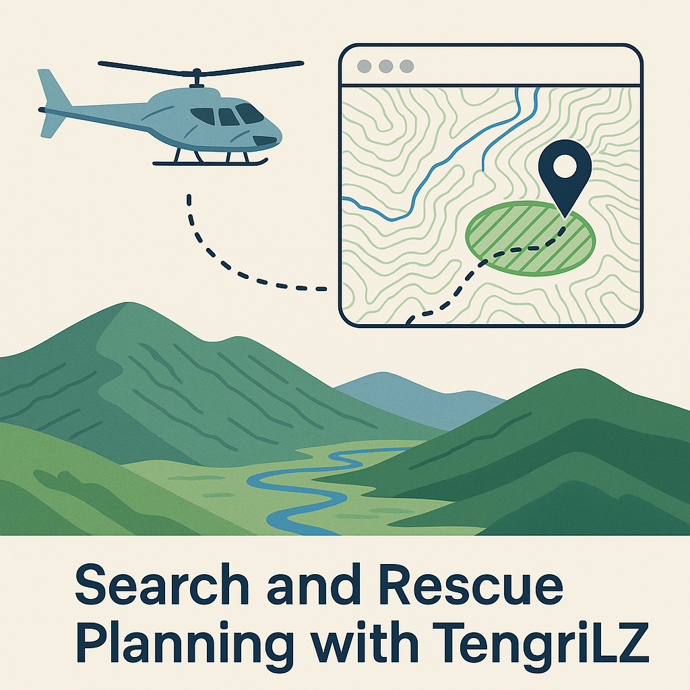

<p align="center">
  
</p>

<h1 align="center">🚁 TengriLZ</h1>

<p align="center">
  <strong>TR | Gökyüzünden Güvenli Zemine</strong><br/>
  <strong>EN | From Sky to Safe Ground</strong>
</p>
<p align="center">
  
</p>

<p><strong>TR:</strong><br/>
TengriLZ, helikopter kurtarma operasyonlarında iniş noktası (Landing Zone - LZ) seçim sürecini hızlandırmak için geliştirilmiş bir yazılım prototipidir.<br/>
Arazi verilerini (DEM – Dijital Yükseklik Modeli) analiz ederek, düz ve güvenli bölgeleri otomatik olarak önerir.</p>

<p><strong>EN:</strong><br/>
TengriLZ is a software prototype developed to accelerate the selection of Landing Zones (LZ) during helicopter rescue operations.<br/>
By analyzing terrain data (DEM – Digital Elevation Model), it automatically identifies flat and safe areas suitable for landing.</p>

---

## 📍 Özellikler / Features

- **TR:**  
  - DEM verisinden eğim (slope) hesaplama  
  - Slope < helikopter limitleri için aday bölgelerin maskelenmesi  
  - GeoJSON çıktısı ile **aday LZ poligonları**  
  - Basit FastAPI servisi + Leaflet harita entegrasyonu  
  - İlk sürüm: sadece eğim analizine dayalı (MVP-0)  

- **EN:**  
  - Slope analysis from DEM raster data  
  - Masking regions below helicopter slope threshold  
  - GeoJSON export of **candidate landing zones**  
  - Simple FastAPI backend + Leaflet map UI  
  - Current stage: slope-only prototype (MVP-0)  

---

## 🛠️ Mimari / Architecture

TengriLZ/
data/ # DEM (GeoTIFF)
scripts/ # Python slope & LZ extraction
api/ # FastAPI backend
frontend/ # Leaflet map visualization

---


- **TR:** Python → eğim analizi & GeoJSON üretimi  
- **EN:** Python scripts → slope analysis & GeoJSON output  
- **API:** FastAPI, endpoint `/candidates?lat=..&lon=..`  
- **UI:** Leaflet harita → aday LZ poligonlarını gösterir  

---

## 🔄 Yol Haritası / Roadmap

### M0 (Mevcut / Current)
- [x] DEM’den eğim hesaplama  
- [x] Aday düz alanların çıkarılması  
- [x] GeoJSON + harita görselleştirme  

#### – Terrain-Aware Candidates (Baseline)
We filter flat terrain patches directly from DEM slope analysis.

**Inputs**
- `lat`, `lon` (center coordinate, decimal degrees)
- `window_m` (analysis window radius in meters)
- `slope_max_deg` (maximum slope threshold)
- `min_diameter_m` (minimum landing circle diameter)
- `morph` (`opening` / `closing`)

**Algorithm**
1. Cut DEM window around `(lat, lon)` with radius `window_m`.
2. Compute slope for each DEM cell.
3. Threshold mask: `slope <= slope_max_deg`.
4. Apply morphology (`opening` or `closing`) to smooth patches.
5. Extract candidate polygons.
6. Compute properties:
   - `clear_radius_m`  
   - `bbox_diameter_m`  
   - `slope_max_deg` (recorded from input)  
7. Keep candidates where `bbox_diameter >= min_diameter_m`.

**Behavior**
- Output = GeoJSON `FeatureCollection` with `Polygon` patches and `Point` centers (`LZ-CENTER-*`).
- If window too small (DEM resolution issue), returns empty `features`.

**Example**
`/candidates?lat=37.7119&lon=36.4902&window_m=2000&slope_max_deg=12&min_diameter_m=30&morph=opening`

**Output (simplified)**
```json
{
  "type": "FeatureCollection",
  "features": [
    {
      "type": "Feature",
      "properties": {
        "id": "LZ-CENTER-1",
        "clear_radius_m": 145.0
      },
      "geometry": { "type": "Point", "coordinates": [36.4902, 37.7119] }
    },
    {
      "type": "Feature",
      "properties": {},
      "geometry": {
        "type": "Polygon",
        "coordinates": [[[36.49,37.71],[36.49,37.72],[36.48,37.72],[36.48,37.71],[36.49,37.71]]]
      }
    }
  ],
  "meta": {
    "window_m": 2000,
    "slope_max_deg": 12,
    "morph": "opening"
  }
}

```

---

### M1
- [x] Helikopter parametreleri (rotor çapı, min açıklık, slope limiti)  
- [x] Candidate filtering by aircraft specs  

#### Aircraft-Aware Candidates
We filter landing candidates by aircraft specs.

**Inputs**
- `aircraft_code` (optional preset)
- `rotor_diameter_m`, `safety_margin_m`, `k`
- `slope_max_deg`, `min_diameter_m` (will be overridden by computed min_clear when larger)

**Formula**
`min_clear_diameter_m = max(min_diameter_m, (rotor_diameter_m + safety_margin_m) * k)`

**Behavior**
- Only patches with `bbox_diameter >= min_clear_diameter_m` are kept.
- Ranking favors larger clear diameter and lower slope.

**Example**
`/candidates?...&aircraft_code=EC135&rotor_diameter_m=10.2&safety_margin_m=6&k=1.5&slope_max_deg=8`


### M2
- [ ] DSM / uydu gölgesi ile **engel yüksekliği (ağaç, bina)** analizi  
- [ ] Clearance & obstacle checks  

### M3
- [ ] LZ scoring function (slope, clearance, surface type)  
- [ ] Approach corridor önerisi (rüzgâr & eğim yönü)  

### M4
- [ ] Pilot UI (tablet uyumlu, offline tiles desteği)  
- [ ] Field tests with rescue pilots  

---

## 🚀 Kullanım / Usage

### TR
1. `data/dem.tif` dosyasını indir (OpenTopography / NASADEM).  
2. Script çalıştır:  
   ```bash
   python scripts/lz_candidates.py > data/candidates.geojson
3. API başlat:
   uvicorn api.main:app --reload
4. Tarayıcıda haritayı aç:
   python -m http.server -d frontend 8081
   #### http://localhost:8081
5. Test için: python -m pytest


### EN
1. Place data/dem.tif (GeoTIFF DEM from OpenTopography/NASADEM).
2. Run slope extraction:
   ```bash
   python scripts/lz_candidates.py > data/candidates.geojson
3. Start API:
   uvicorn api.main:app --reload
4. Serve map UI:
   python -m http.server -d frontend 8081
   #### http://localhost:8081
5. For test: python -m pytest

---

## 🌍 İsim / Name

### TengriLZ
- TR: "Gökyüzünden Güvenli Zemine"
- EN: "From Sky to Safe Ground"

---

### ⚠️ Notlar / Notes
- TR: Bu proje bir araştırma prototipidir, gerçek operasyonlarda yalnızca yardımcı sistemi olarak düşünülebilir. Nihai karar pilotta olmalıdır.
- EN: This is a research prototype. For real misions, TengriLZ should only be considered an advisory system; the final decision must remain with the pilot.

---

---

## ✒️ İthaf / Dedication

- **TR:** Bu proje, 2009 yılında helikopter kazasında hayatını kaybeden **Muhsin Yazıcıoğlu**’na ithaf edilmiştir.  
- **EN:** This project is dedicated to **Muhsin Yazıcıoğlu**, who lost his life in a helicopter crash in 2009.

---

## 🙏 Special Thanks

- **TR:** Türk Silahlı Kuvvetleri’nin fedakâr pilotlarına ve arama-kurtarma ekiplerine — gökyüzünden güvenli zemine uzanan zorlu görevlerde gösterdikleri cesaret için.  
- **EN:** To the dedicated pilots and search & rescue crews of the Turkish Armed Forces — for their courage in missions that bridge the sky and the safe ground.
